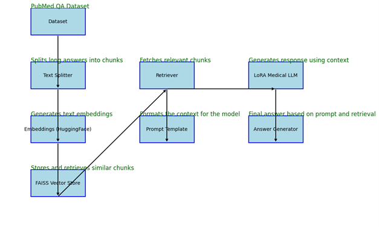

# MedQA: Medical Question-Answering System


## Table of Contents
- [Overview](#overview)
- [Features](#features)
- [Architecture](#architecture)
- [Installation](#installation)
- [Usage](#usage)
- [Model Details](#model-details)
- [RAG Implementation](#rag-implementation)
- [Web Application](#web-application)
- [Performance](#performance)
- [Future Improvements](#future-improvements)
- [Contributing](#contributing)
- [License](#license)

## Overview
MedQA is an advanced medical question-answering system that leverages the power of Llama 3.1-8B model and Retrieval-Augmented Generation (RAG) to provide accurate and contextual answers to medical queries. Built on the PubMedQA dataset, this system combines state-of-the-art language models with efficient information retrieval techniques.

## Features
- **Accurate Medical QA**: Fine-tuned for medical domain questions
- **RAG-Enhanced Responses**: Combines retrieval and generation for evidence-based answers
- **User-Friendly Interface**: Gradio-based web application
- **Source Transparency**: Provides references for generated answers
- **Efficient Processing**: Optimized with LoRA fine-tuning
- **Scalable Architecture**: Modular design for easy updates and improvements

## Architecture


### Components:
1. **Model Layer**
   - Llama 3.1-8B base model
   - LoRA fine-tuning adaptations
   - Custom stop sequences and sampling controls

2. **Retrieval Layer**
   - FAISS vector store
   - Sentence-transformer embeddings
   - Top-k document retrieval

3. **Integration Layer**
   - LangChain RetrievalQA chain
   - Custom LoRAMedicalLLM implementation
   - Gradio web interface

## Installation
```bash
# Clone the repository
git clone https://github.com/VijayendraDwari/MedQA.git
cd MedQA

# Create virtual environment
python -m venv venv
source venv/bin/activate  # On Windows: venv\Scripts\activate

# Install dependencies
pip install -r requirements.txt
